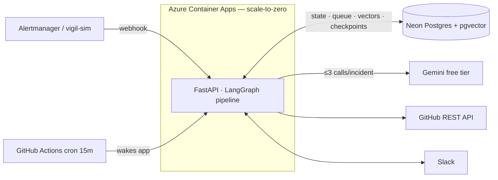

# Vigil 🚨

**An autonomous incident responder.** The moment a production alert fires, Vigil identifies the
likely bad commit from git history, retrieves the relevant runbook with hybrid RAG, estimates
user impact, and posts a structured brief to the on-call Slack channel — in under a minute. When
you mark the incident resolved, it writes the blameless postmortem.

*Demo GIF coming with the dashboard milestone — can run the 2-minute demo below.*

## The problem

The first ten minutes of an incident are spent gathering context: what changed, who owns this,
where's the runbook, how bad is it. Vigil does that gathering in seconds, so on-call starts at
the "act" step instead of the "search" step.

## Architecture



Every inbound signal is HTTP; every piece of state lives in Postgres. The container is killed
routinely (scale-to-zero) and an in-flight incident **resumes from its LangGraph checkpoint** —
exactly once, no duplicate LLM spend. Details: [`docs/architecture.md`](docs/architecture.md).

## Quickstart (offline — no API keys needed)

```bash
docker compose up -d db
uv sync
uv run vigil-serve                              # terminal 1
uv run vigil-sim demo --scenario bad_deploy     # terminal 2 — full incident in ~15s
```

## Demo scenarios

| Scenario | Alert | Planted culprit | Shows off |
|---|---|---|---|
| `bad_deploy` | HighErrorRate | validation removed in a refactor | deploy correlation |
| `db_migration_lock` | SlowQueries | non-CONCURRENT index build | risky-file scoring |
| `memory_leak` | HighMemory | unbounded cache, 30h old | time-decay vs path-match |
| `config_typo` | CrashLoopBackOff | one-character YAML change | tiny-diff risk weighting |
| `dependency_bump` | HighLatency | lockfile bump | dependency heuristics |
| `cert_expiry` | TLSHandshakeErrors | **none exists** | honest "no culprit found" |

## Design decisions (the interview-bait, with receipts)

- **≤3 LLM calls per incident** — deterministic pre-scoring ranks commits *before* the LLM sees
  anything; severity is a rules table; re-ranking is folded into the brief call. ([ADR-007](docs/decisions.md))
- **Postgres as the queue** — `FOR UPDATE SKIP LOCKED` + stale-claim reclaim beats Kafka at
  dozens-of-alerts-a-day scale. ([ADR-003](docs/decisions.md))
- **Hybrid retrieval** — pgvector cosine + full-text search fused with RRF; runbooks are full of
  exact identifiers where lexical wins. ([ADR-004](docs/decisions.md))
- **Scale-to-zero + checkpoint resumability** — a cron-driven `/internal/resume` wakes the app,
  resumes stranded graphs, and prunes the DB. ([ADR-006](docs/decisions.md))
- **The brief always posts** — every pipeline node degrades gracefully; if all LLM calls fail,
  a deterministic Block Kit brief ships from the heuristics alone.

## Cost: $0/month

Gemini free tier (no card) · Neon free tier (no card) · Azure Container Apps free grant ·
GitHub Actions free minutes · Slack free workspace · Vercel free tier.

## Testing

```bash
uv run pytest                   # 65 unit tests: golden scoring values, chunker, severity rubric…
uv run pytest -m integration    # full pipeline vs real Postgres + fixture LLM, exactly-once checks
```

The commit scorer has golden tests with hand-computed expected values, and every scenario's
planted culprit must rank #1 (`cert_expiry` must rank *nothing*). LLM fixtures are validated
through the real Pydantic schemas, so schema drift fails CI loudly.

## Deploying

TODO

## Roadmap

TODO
